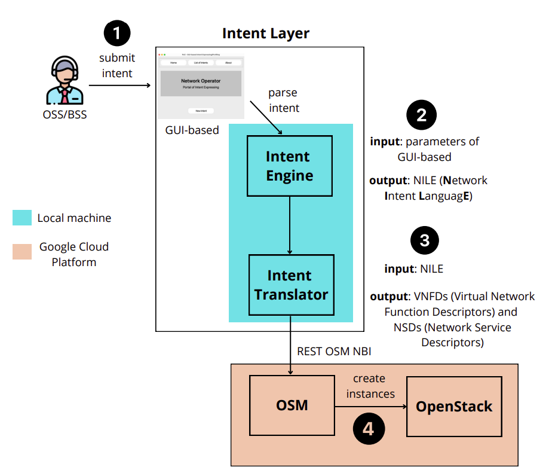

## Intent Layer


---

- [Description](#description)
- [Architecture](#architecture)
- [Intent layer components workflow](#intent-layer-components-workflow)
- [Requirements](#requirements)
- [How to install](#how-to-install)
- [How to run](#how-to-run)

--- 
### Description

---

This repository contains the code
for intent layer software and instructions to run in top of
an NFV environment. **`Intent Layer`** has 3 (three) main modules:


**1)** **`intent_gui.py`**- GUI-based for intent expressing;

**2)** **`intent_engine.py`**- Convert intents into NILE (**N**etwork **I**ntent **L**anguag**E**);

**3)** **`intent_translator.py`**- Convert NILE to suitable format e.g., VNFd (Virtual Network Function Descriptor) and NSd (Network Service Descriptor), and trigger network slice creation;

---
###  Architecture

---



---

### Intent layer components workflow

---


---

### Requirements

- python3. 
- pip3. 
- VM/Bare metal with [OSM](https://osm.etsi.org/). 
- VM/Bare metal with [OpenStack](https://docs.openstack.org/devstack/latest/).
---
### How to install

---
**1)** Clone the repository:

```
cd ~ && git clone https://github.com/mariotlemes/intent_layer.git
```

**2)** Export the os environment IP_ADDRESS_OSM, where **A.B.C.D** represents the IPv4 address for OSM (Open
Source Mano):
```
export IP_ADDRESS_OSM="A.B.C.D"
```

**3)** Install requirements.txt:
```
cd ~/intent_layer
```

```
python3 -m venv .venv
```

```
source .venv/bin/activate
```

```
pip install --upgrade pip
```

```
pip3 install -r requirements.txt
```
---
### How to RUN

---
**1)** intent-GUI:

```
python3 ~/intent_layer/intent_gui.py
```
